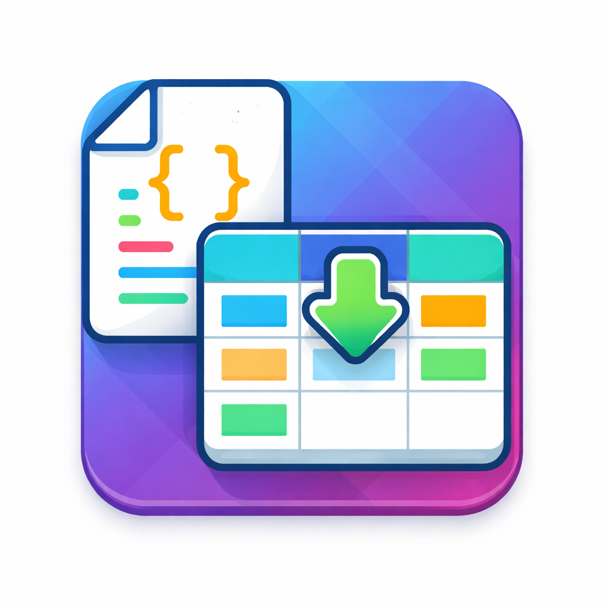
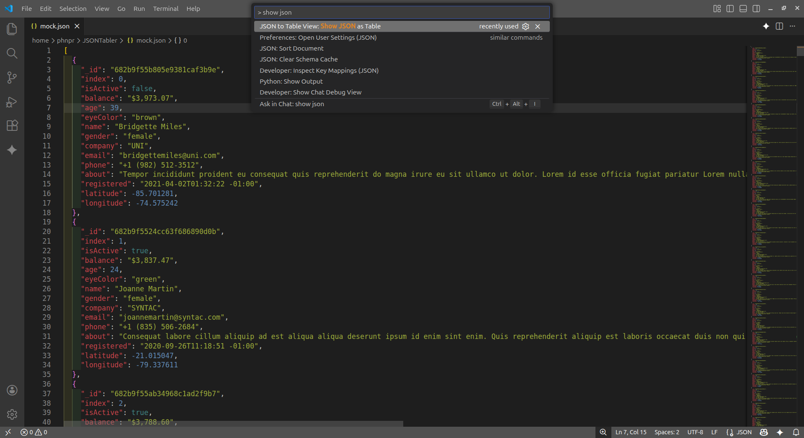
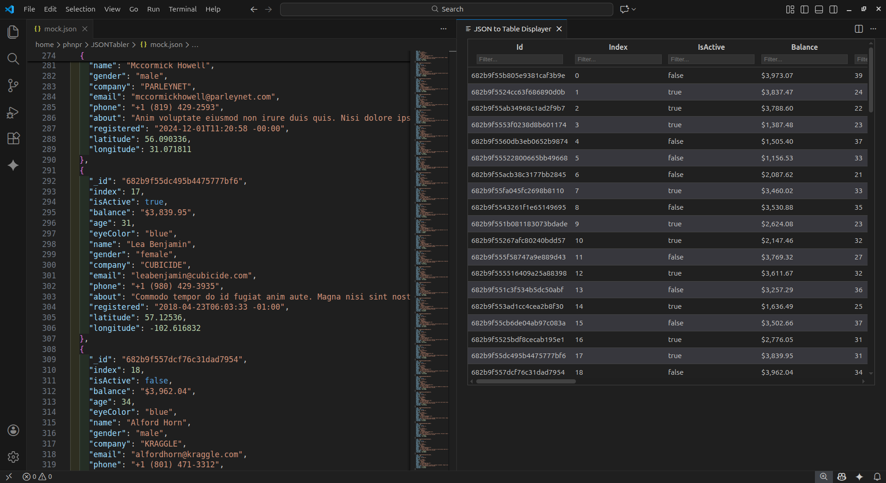
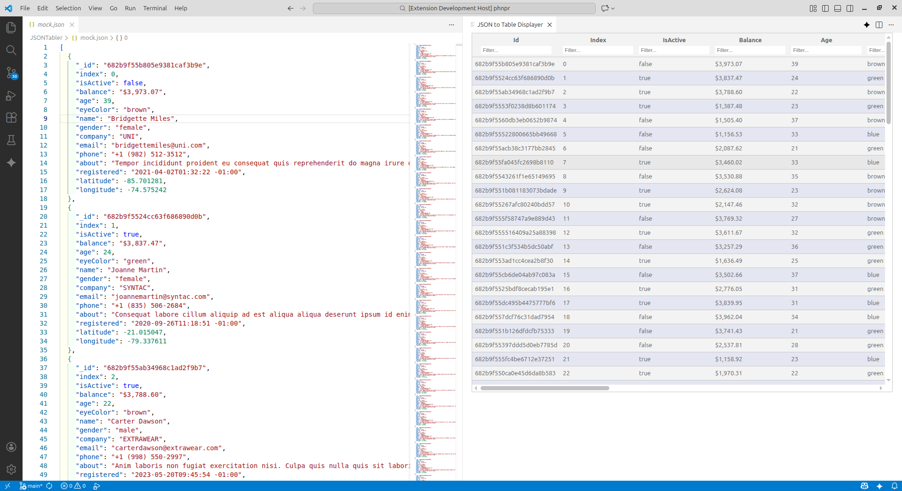

  

# JSONTabler - JSON to Table View

**JSONTabler - JSON to Table View** transforms flat JSON files into a clean, spreadsheet-like table rendered directly inside **Visual Studio Code**.

View, explore, and analyze your JSON data without leaving the editor.

## Features

* **Column Filtering** — quickly narrow down data
* **Column Sorting** — sort rows with a click
* **Column Resizing** — adjust columns to fit your data
* **Hover Preview** — view full cell content without resizing columns
* **Theme-Aware UI** — seamlessly matches your current VS Code theme

## 🚀 Getting Started

1. Open any JSON file (`.json`)
2. Press `Ctrl + Shift + P`
3. Select **Show JSON as Table**
4. A new editor pane opens displaying your data in a table format

That’s it.

---

## 📸 Working Example

### Command Palette

### Table View (Dark Theme)

### Table View (Light Theme)

